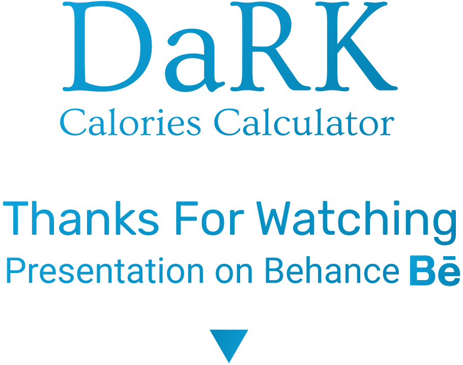

<!-- # DaRK Calories Calculator
The Easiest & Fastest Way To Calculate Your Calorie Needs
 -->


# 

## Features 
By using Mifflin - St Jeor equation & using Adolphe Quetelet equation
-  Calculate your calorie needs to maintain weight 

-  Calculate your calorie needs to gain weight 

-  Calculate your calorie needs to lose weight 

-  Calculate your BMI

# Screenshots


You can find the full presentations on <a href="https://www.behance.net/gallery/123682903/DaRK-Calories-Calculator-UIUX">Behance</a>

# How To use / install it

### use the custom environment

```bash
source .venv/bin/activate
```
then just run it 
```bash
python main.py
```

<!--  -->

### or can install it on your os
you must install
```bash
Python 3.9.6
```
then you must install the requirements

```bash
pip install -r requirements.txt
```

or 

```bash
pip3 install -r requirements.txt
```

then just run it 
```bash
python main.py
```

or 

```bash
python3 main.py
```

if you want to edit the ui files you need to install Qt5 Designer

<br>

## You need to install Rubik fonts if you haven't
#### 
<p >you can unzip Rubik.zip file or you can download it from <a href="https://fonts.google.com/specimen/Rubik">Google Fonts </a></p>

<hr>

<br>
<br>



<p align="center">The full presentation on <a href="https://www.behance.net/gallery/123682903/DaRK-Calories-Calculator-UIUX">Behance</a></p>